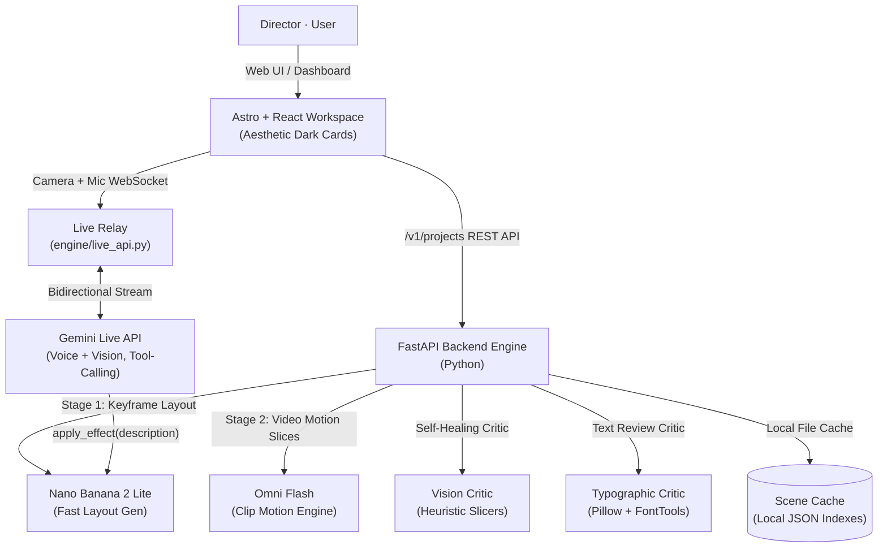

# Arena

### Direct the shot. Skip the timeline.

*Describe a scene and approve its frame for pennies before anything gets animated — swap elements, shift the light, and compile multi-shot visual stories, all by saying so.*

[**Open Studio**](http://localhost:4321) · [**Backend Specs**](http://localhost:8000/docs) · [**Astro Workspace**](web/)

---

## What is Arena?

Professional video editors and VLMs are siloed. Creating high-fidelity video clips usually requires complex timing tracks, manual keyframe coordination, and expensive rendering runs. Leave to alter a single element, and you are forced to re-animate the whole sequence from scratch.

**Arena** is an interactive conversational director and video editing sandbox that chains **Nano Banana 2 Lite** (for high-speed layout keyframing) into **Omni Flash** (for motion animation) inside a unified interface. You describe your story in plain English, approve or modify frames instantly, and build complex timelines directly from a gorgeous, card-based creative workspace.

One integrated interface, three cohesive layers:

- **Magnific-Inspired Studio** — A state-of-the-art dark terminal layout featuring an expanding sidebar, custom category quick-launches, and single-click sandbox scene compilation.
- **Interactive Multi-Track Sidebars** — Functional audio synthesizers, canvas-based live mic voice capture, SRT-synced caption auto-transcribers, and typographic title designers that directly patch the timeline.
- **Cascade Python Engine** — High-speed API router which hosts automated vision critics, typographic layout verifiers, and self-healing error repairs.

> **Why it matters:** Video generation is only a sandbox if you can edit, trim, overlay, and refine. Arena sits above raw text-to-video generators — it models, reasons, critics, and patches. Because the editor is conversational, your workflow is non-linear: swap camera tilts, shift golden-hour light, or adjust contrast by simply saying so. No timeline friction.

---

## 🏛️ System Architecture

Arena's layout is divided into a server-side Python intelligence cascade and a high-fidelity Astro/React frontend console.

**The Generation Pipeline:**

| Component | AI Model | Task | Cost Tier |
|-----------|----------|------|-----------|
| **Keyframe Generator** | **Nano Banana 2 Lite** | Generates 16:9 still drafts based on descriptions | **$0.0004 / frame** |
| **Motion Generator** | **Omni Flash** | Animates stills into fluid 30 FPS video slices | **$0.0175 / second** |
| **Typographic Critic** | Heuristic parser | Checks bounding boxes, font heights, and contrast margins | **Deterministic** |
| **Vision Critic** | In-engine VLM | Inspects generated clips for physics glitches and lighting tears | **Self-Correction** |
| **Live Director** | **Gemini Live API** | Listens/watches a live camera+mic feed and triggers keyframe generation by voice, mid-conversation | **Tool-Call Triggered** |

---

## Features

### 🎨 Premium Studio Portal
- **Magnific-Inspired UI** — High-contrast deep warm dark theme (`#08080A`), colorful tool categories, promotional unlimited badges, and split-panel navigation.
- **Unified Left Navigation** — Fully active collapsible left sidebar featuring single-click scene creator triggers (`+ Create shot`) and interactive panel toggles.
- **Interactive Dashboard Categories** — Quick-launch tiles mapping direct access to **Spaces** (Subtitles), **Image** (Media Bin), **Video** (Storyboard canvas), **Audio** (Tracks), **Design** (Title layouts), and **3D Sandbox**.
- **Active Sandbox Sandbox** — Interactive Projects folder listings, team UPGRADE locks, and nodes canvas flowchart vector graphics (SVG bezier links) that jump straight into active editing scenes.

### 🎛️ Interactive Multi-Track Tools
- 📁 **Media Bin** — Interactive generated clip collections, failed job boundaries, reference asset uploads, and clip timeline inspectors.
- 📋 **Storyboard settings** — Multi-take grids,Sequence order listings with direct index select, and export scripts.
- 🎵 **Music & Audio** — Preset cinematic background themes with **dynamic vertical equalizer animations** reacting in real-time, volume mixers, and timeline modifiers.
- 💬 **Captions** — Style presets (Netflix, TikTok uppercase, cinematic), caption auto-transcribers with progress indicators, and active timeline subtitle inputs.
- 🎙️ **Voiceover & TTS** — Multiple announcer text-to-speech selectors, speed multipliers, and a **live microphone recorder** with active timer and wave level-meters.
- 🔠 **Title Overlays** — Motion title overlay designers (Cinematic Acts, Lower Thirds, Cyberpunk Glitches) with tracking letter spacing, font scales, and timeline applying hooks.

### 🎥 Arena Live — voice-directed camera effects
- Point a camera at yourself, talk continuously, and ask for an effect ("give me a fireball," "make it blue," "turn it into lightning") — it appears without touching a keyboard.
- Built on the **Gemini Live API** (`client.aio.live`), a stateful bidirectional WebSocket session streaming camera + mic in and getting native audio + tool calls out — no polling, no separate ASR/TTS.
- Gemini decides when to trigger generation via a real `apply_effect(description)` tool call, reasoned from the live conversation rather than keyword-matched.
- Reuses the existing keyframe engine end-to-end (`generate_image(role="scene", refs=[...])`) — zero new pixel-synthesis code, only a new relay layer (`engine/live_api.py`) in front of it.

### 🐍 The Python Core Engine
- **Dual-Model Router (`engine/shots/`)** — Streamlined API layers that coordinate Nano Banana 2 and Omni Flash triggers.
- **Graphic Vision Critic (`engine/critic/vision.py`)** — Inspects video files for pixel tearing, color clipping, or prompt omissions.
- **Typographic Layout Critic (`engine/critic/typography.py`)** — Python-native canvas checks calculating word wrapping, font size bounds, and contrast safety margins.
- **Self-Healing Layout Repair (`engine/repair.py`)** — Automated repair assistant which sifts layout errors, computes corrective edits, and updates scene documents on-the-fly.
- **Live Relay (`engine/live_api.py`)** — FastAPI WebSocket endpoint owning the Gemini Live session per project, relaying camera/mic in and generated frames + transcripts out.

---

## 📄 License

Released under the **MIT License**.

Built by Arena Systems · Inspired by Magnific AI UI

